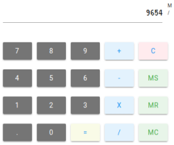

playground-binding.scala
========================
[](https://tldrlegal.com/license/mit-license) [](https://travis-ci.org/ccamel/playground-binding.scala)

> My playground I use for playing with fancy and exciting technologies. This one's for [scala], [scalajs] and [binding.scala].

## Purpose

The purpose of this playground is to explore, study and assess in the first place the [binding.scala] library, and secondly [scalajs].

The showcases are intented to:

- be fairly simple and understandable (static [SPA]); 
- highlight some aspects of the [binding.scala] library, like binding forms, fine-grained bindings, performance, interoperability with other JS libraries... 
- provide some functional content;
- be deployable into [scalafiddle].


You can view and play the showcases [here](https://ccamel.github.io/playgrounds/playground-binding.scala/index.html). 

## Showcases

### Calc

#### Purpose

Calc is a very simple and basic calculator. You can play with it here: [scalafiddle-calc].

[](https://ccamel.github.io/playgrounds/playground-binding.scala/index.html#playground-binding.scala/calc)

#### Implementation details

The model is an immutable `case` class which holds the state of the calculator. The behaviour is implemented by this model 
as a [partial function](https://www.scala-lang.org/api/current/scala/PartialFunction.html) which accepts tokens (digit, operators).    

The gui maintains the whole model in a single [bindable variable](https://static.javadoc.io/com.thoughtworks.binding/unidoc_2.11/11.0.0-M1/index.html#com.thoughtworks.binding.Binding$$Var),
and every graphical element of the calculator (buttons, display) needing to be updated upon model change (reactive dom) is bound to that variable.  


### Led Matrix

#### Purpose

The idea under this showcase is to build a virtual matrix of cells, each cell having a color and is independently addressable.

The view consists in binding each cell to a dom element (actually a `span`) in order to render the color. As the matrix can have a significant number of cells (~1000),
it allows to appreciate the performance of the [binding.scala] library to handle the situation.  

Beside this, some (simple) demos have been implemented that play with the virtual screen. Each demo displays a form which allows to set some parameters whose values are taken in real time.

- _Constant color_ demo:  display a single background color. The components r, g, b of the color can be adjusted in real time.
- _Random_ demo: turns on random pixels with random colors.
- ...

### SVG

comming soon

### d3.js

comming soon


## Technologies

[![scala-logo][scala-logo]][scala]

[![scalajs-logo][scalajs-logo]][scalajs]

[![binding.scala-logo][binding.scala-logo]][binding.scala]

[![materializecss-logo][materializecss-logo]][materializecss]

## Building and Running

The build can be launched with:

```bash
sbt ~fastOptJS
```

Then, open `./index.html` file in your browser.


## License

[MIT] © [Chris Camel]

[scala]: https://www.scala-lang.org/
[scala-logo]: doc/assets/logo-scala.png

[scalajs]: https://www.scala-js.org/
[scalajs-logo]: doc/assets/logo-scalajs.png
[binding.scala]: https://github.com/ThoughtWorksInc/Binding.scala
[binding.scala-logo]: doc/assets/logo-binding.scala.png
[materializecss]: http://materializecss.com/
[materializecss-logo]: doc/assets/logo-materializecss.png

[scalafiddle]: https://scalafiddle.io
[scalafiddle-calc]: https://scalafiddle.io/sf/hbwbCOe/0

[SPA]: https://en.wikipedia.org/wiki/Single-page_application

[Chris Camel]: https://github.com/ccamel
[MIT]: https://tldrlegal.com/license/mit-license
