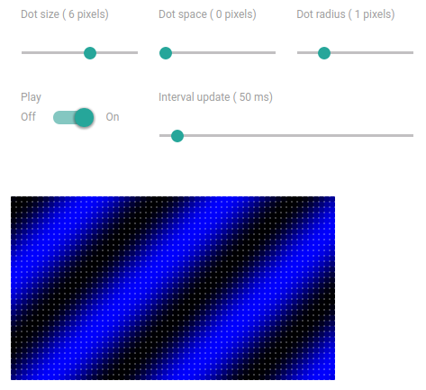
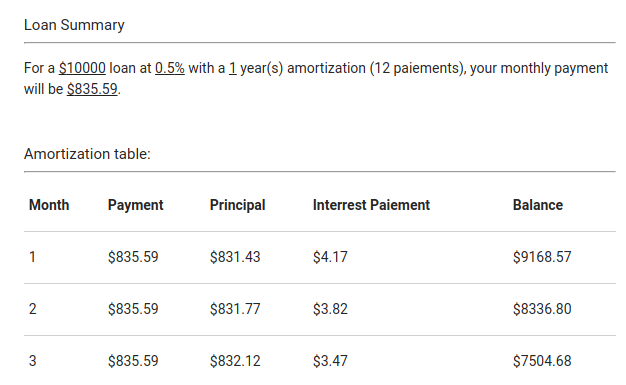
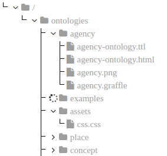
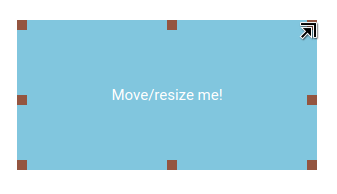
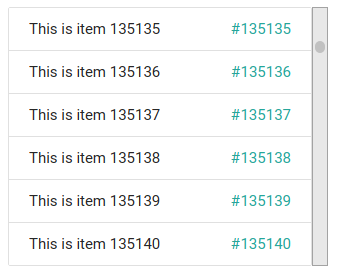

playground-binding.scala
========================
[](https://tldrlegal.com/license/mit-license) [](https://travis-ci.org/ccamel/playground-binding.scala) [](https://www.scala-js.org)

> My playground I use for playing with fancy and exciting technologies. This one's for [scala], [scalajs] and [binding.scala].

## Purpose

The purpose of this playground is to explore, study and assess in the first place the [binding.scala] library, and secondly [scalajs].

The showcases are intended to:

- be fairly simple and understandable (static/serverless [SPA]); 
- highlight some aspects of the [binding.scala] library, like binding forms, fine-grained bindings, performance, interoperability with other JS libraries... 
- explore some architectural/design patterns around reactive GUIs
- provide some functional content;
- be deployable/playable into [scalafiddle].

You can view and play the showcases here:

<p align="center">
<a href="https://ccamel.github.io/playground-binding.scala/index.html">View !</a>
</p>

## Showcases

All the showcases come in a single SPA page.

The `binding.scala route library` is used to enable the navigation and maintain the link between URLs and pages to display.

### Calc

#### Purpose

Calc is a very simple and basic calculator.

<p align="center">
  <b>Links:</b><br>
  <a href="https://ccamel.github.io/playground-binding.scala/index.html#playground-binding.scala/calc">Play</a>  |
  <a href="https://scalafiddle.io/sf/hbwbCOe/0">View Scalafiddle</a>
  <br><br>
  <kbd></kbd>
</p>

#### Implementation details

The model is an immutable `case` class which holds the state of the calculator. The behaviour is implemented by this model 
as a [partial function](https://www.scala-lang.org/api/current/scala/PartialFunction.html) which accepts tokens (digit, operators).    

The gui maintains the whole model in a single [bindable variable](https://static.javadoc.io/com.thoughtworks.binding/unidoc_2.11/11.0.0-M1/index.html#com.thoughtworks.binding.Binding$$Var),
and every graphical element of the calculator (buttons, display) needing to be updated upon model change (reactive dom) is bound to that variable.  

### Led Matrix

#### Purpose

The idea under this showcase is to build a virtual matrix of cells, each cell having a color and is independently addressable.

<p align="center">
  <b>Links:</b><br>
  <a href="https://ccamel.github.io/playground-binding.scala/index.html#playground-binding.scala/led-matrix">Play</a>  |
  <a href="https://scalafiddle.io/sf/nXYqFFS/6">View Scalafiddle</a>
  <br><br>
  <kbd></kbd>
</p>

#### Details

The view consists in binding each cell to a dom element (actually a `span` or an `SVG rect`) in order to render the surface. As the matrix can have a significant number of cells (~2000),
it allows to appreciate the performance of the [binding.scala] library to handle the situation.  

Beside this, some (simple) demos have been implemented that play with the virtual screen. Each demo displays a form which allows to set some parameters whose values are taken in real time.

- _Constant color_ demo:  display a single background color. The components r, g, b of the color can be adjusted in real time.
- _Random_ demo: turns on random pixels with random colors.
- _Plasma_ demo: display some (minimal) [plasma effects](https://en.wikipedia.org/wiki/Plasma_effect).
- ...

### Loan Calculator

Simple loan calculator which determines the monthly payments on a loan.

<p align="center">
  <b>Links:</b><br>
  <a href="https://ccamel.github.io/playground-binding.scala/index.html#playground-binding.scala/loan-calculator">Play</a>  |
  <a href="https://scalafiddle.io/sf/1RxSQj6/1">View Scalafiddle</a>
  <br><br>
  <kbd></kbd>
</p>

### Tree View

Example of a simple tree view implementation with dynamic loading of elements.  

<p align="center">
  <b>Links:</b><br>
  <a href="https://ccamel.github.io/playground-binding.scala/index.html#playground-binding.scala/tree-view">Play</a>  |
  <a href="https://scalafiddle.io/sf/KEznYyM/2">View Scalafiddle</a>
  <br><br>
  <kbd></kbd>
</p>

#### Details

The model is a simple recursive structure built with [Vars](https://static.javadoc.io/com.thoughtworks.binding/unidoc_2.11/11.0.0-M2/index.html#com.thoughtworks.binding.Binding$$Vars) (mutable and observable sequence of elements).

The view is bound to the model and react by displaying parts of the tree that have changed.

### Drag-me
 
The Drag-me showcase is quite similar to [elm drag](http://elm-lang.org/examples/drag) but with more features.

It allows the user to select, move and resize a simple rectangle form.

<p align="center">
  <b>Links:</b><br>
  <a href="https://ccamel.github.io/playground-binding.scala/index.html#playground-binding.scala/drag-me">Play</a>  |
  <a href="https://scalafiddle.io/sf/obKiF28/8">View Scalafiddle</a>
  <br><br>
  <kbd></kbd>
</p>

### Details

The model is a simple structure holding both the basic geometric properties of the form (position and size) and the current edition mode
(none, moving, resizing).

The view is bound to that model and react to reflect the change (selection, coordinates change, width/height change, etc.).

### virtual-list
 
The virtual-list showcase is quite similar to [virtual rendering 1000000 items](http://www.lab4games.net/zz85/blog/2012/06/23/virtual-rendering-1000000-items-efficiently/).

The idea is to use a list that represents a subset of a larger set of data. That list is automatically updated on events (mouse move, drag, key up/down...), and the dom 
elements bound to the list items are refreshed accordingly.

<p align="center">
  <b>Links:</b><br>
  <a href="https://ccamel.github.io/playground-binding.scala/index.html#playground-binding.scala/virtual-list">Play</a>  |
  <br><br>
  <kbd></kbd>
</p> 
 
## Building and Running

The build can be launched with:

```bash
sbt fastOptJS dist
```

Then, open `./dist/index.html` file in your browser.

## Technologies

[![scala-logo][scala-logo]][scala]

[![scalajs-logo][scalajs-logo]][scalajs]

[![binding.scala-logo][binding.scala-logo]][binding.scala]

[![materializecss-logo][materializecss-logo]][materializecss]

[![fontawesome-logo][fontawesome-logo]][fontawesome]

## License

[MIT] © [Chris Camel]

[scala]: https://www.scala-lang.org/
[scala-logo]: doc/assets/logo-scala.png

[scalajs]: https://www.scala-js.org/
[scalajs-logo]: doc/assets/logo-scalajs.png
[binding.scala]: https://github.com/ThoughtWorksInc/Binding.scala
[binding.scala-logo]: doc/assets/logo-binding.scala.png
[materializecss]: http://materializecss.com/
[materializecss-logo]: doc/assets/logo-materializecss.png
[fontawesome]: http://fontawesome.io/
[fontawesome-logo]: doc/assets/logo-fontawesome.png

[scalafiddle]: https://scalafiddle.io

[SPA]: https://en.wikipedia.org/wiki/Single-page_application

[Chris Camel]: https://github.com/ccamel
[MIT]: https://tldrlegal.com/license/mit-license
